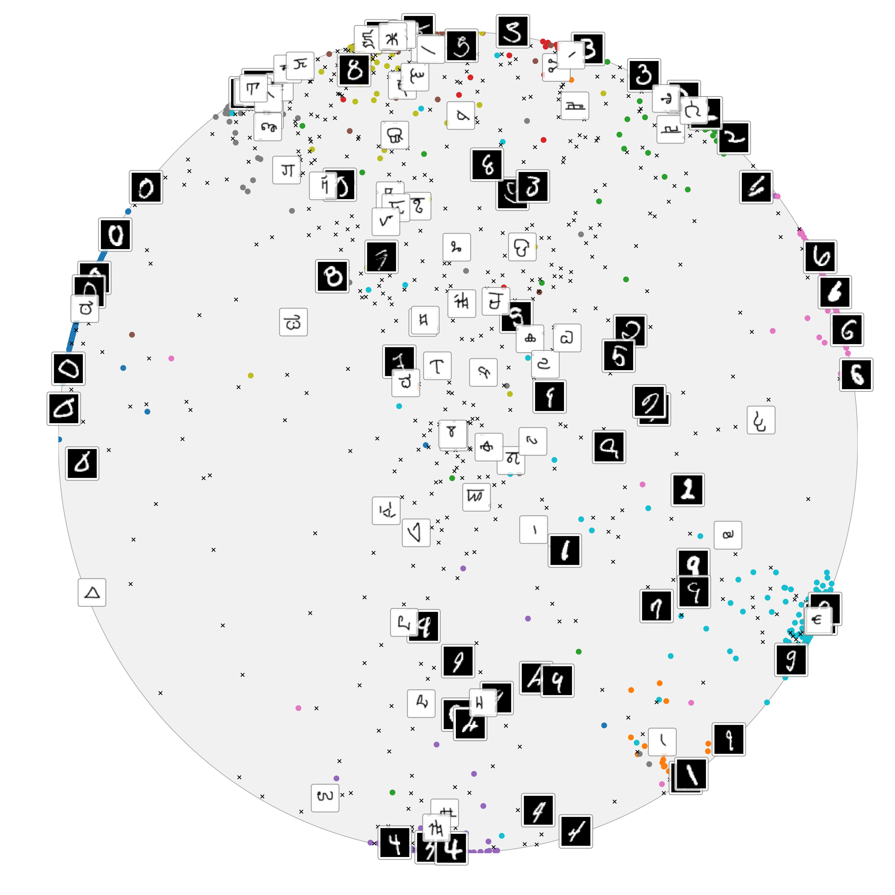
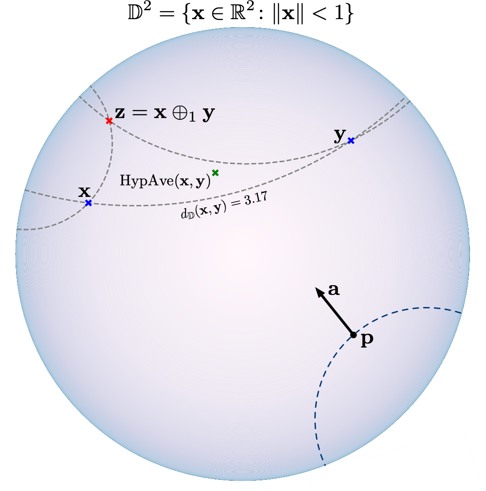

# Hyperbolic Image Embeddings

  
   

### Prerequisites

- [PyTorch-1.0 and torchvision](https://pytorch.org/) 
- [tensorboardX](https://github.com/lanpa/tensorboardX)

### Instructions

To replicate the results on CUB and *Mini*ImageNet, follow the instructions [here](https://github.com/hyperbolic-embeddings/hyperbolic-image-embeddings/tree/master/examples/fewshot) .

### Acknowledgements 

We have used the following repositories in preparation of the code

- [geoopt](https://github.com/geoopt)
- [ProtoNet](https://github.com/cyvius96/prototypical-network-pytorch)
- [FEAT](https://github.com/Sha-Lab/FEAT)
